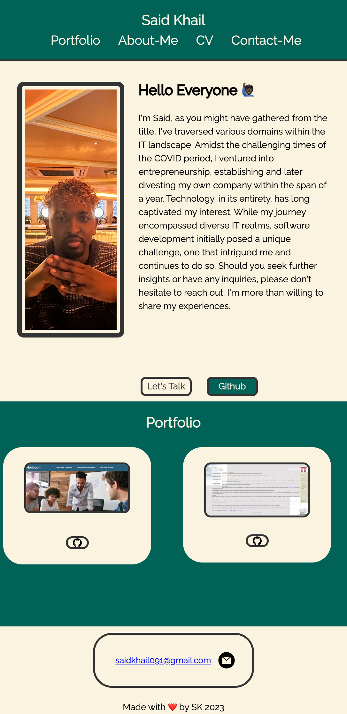

# personal-portfolio

## Description

The task is to create your own portfolio page where you can showcase your current skills and will be added in time during the course.

## Installation

1.  Clone the repository to your local machine using:
    git clone https://github.com/SKhail/personal-portfolio.git
    cd personal-portfolio
2.  Once cloned, you can start the application
3.  You will have it in your local machines and can start the Application.

## Usage

1.  Clone the repository to your local machine using:
    git clone https://github.com/SKhail/personal-portfolio.git
    cd personal-portfolio
2.  Once cloned, you can start the application
3.  You will have it in your local machines and can start the Application.
4.  A screenshot location will be provided below to show how the website looks in mobile device

     

### External Resources

- [we3schools] https://www.w3schools.com/howto howto_css_media_query_breakpoints.asp
- [Semantic HTML] (https://www.w3schools.com/html/html5_semantic_elements.asp)

## Credits

N/A

## License

This project is licened under the MIT License.

## Badges

N/A

## Features

N/A

## Testing

N/A
